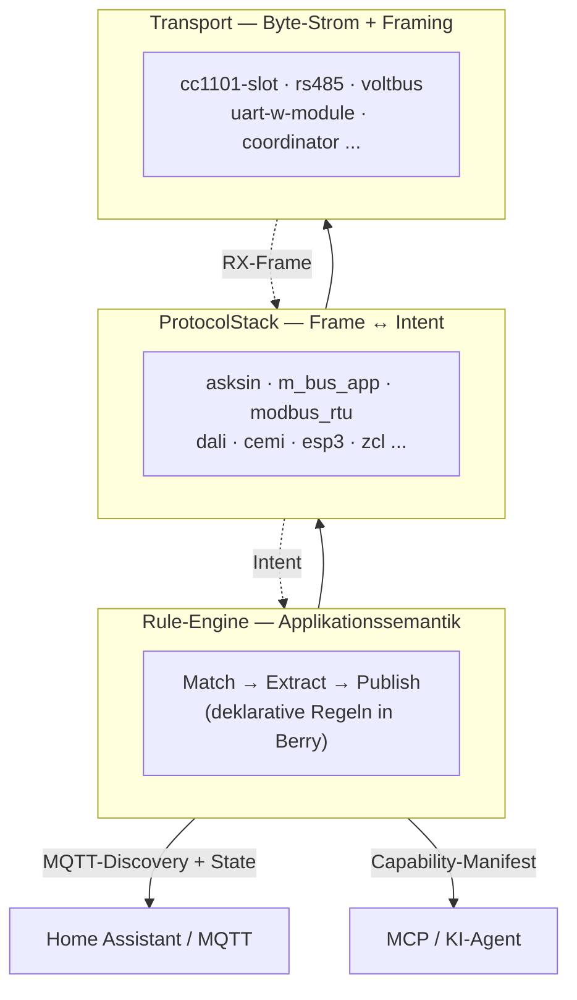
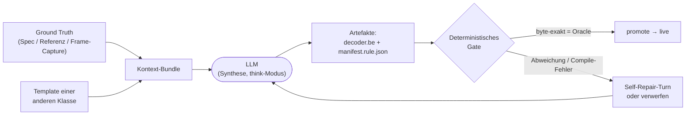
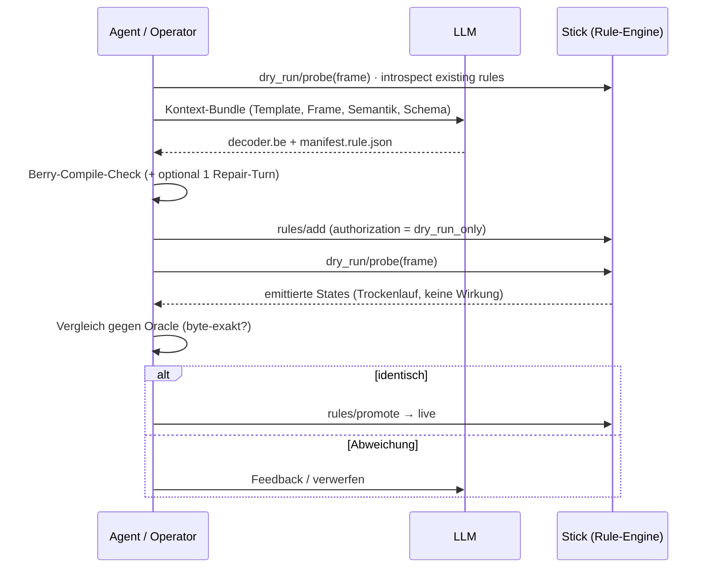
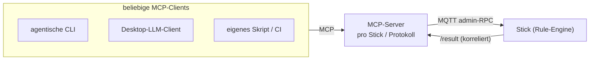
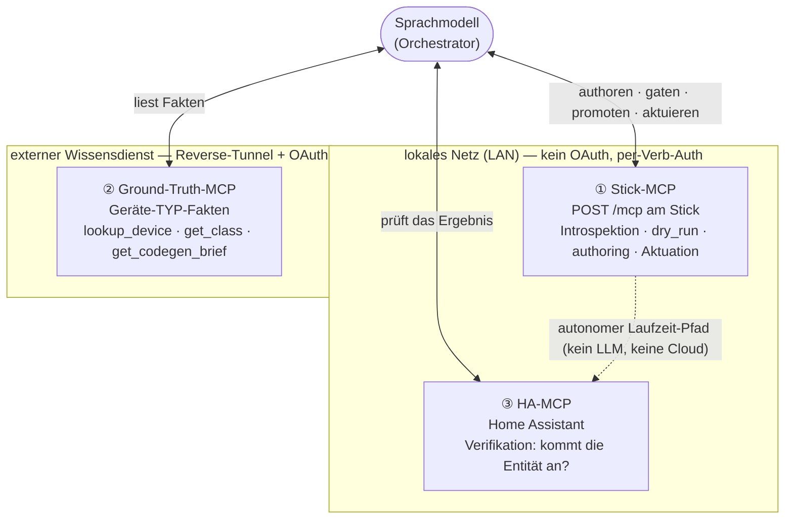
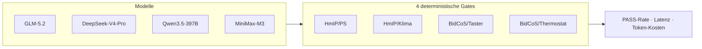
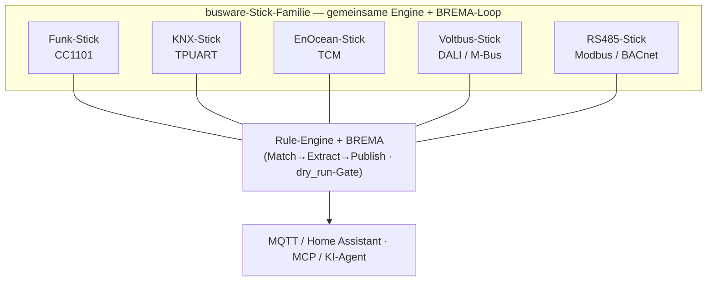

# BREMA — der Busware Rule Engine Model Assistant

### Wie ein Sprachmodell neue Funk- und Bus-Geräte ins Smart Home bringt — ohne Firmware-Flash, mit deterministischem Sicherheitsnetz

*Werkstattbericht, Juni 2026 — aktualisiert im August 2026 zur Veröffentlichung der KNX-Inkarnation (Abschnitt 9b).*

*Ein Werkstattbericht über eine deklarative Regel-Engine für die busware-Stick-Familie und einen LLM-gestützten Onboarding-Loop, der Geräte-Decoder aus strukturierter Ground Truth synthetisiert, am Stick installiert und byte-genau gegen ein Oracle prüft — gezeigt an HomeMatic (BidCoS) und Homematic IP; als zweite Inkarnation inzwischen für **KNX veröffentlicht** — dort nimmt der Loop Geräte *in Betrieb* (Adressen, Tabellen, Parameter), statt sie nur zu dekodieren. Ausblick auf Zigbee, EnOcean, Modbus, DALI und M-Bus. Der gesamte Loop läuft über eine offene MCP-Tool-Oberfläche, die drei Dienste zusammenspannt — den Stick selbst, einen separaten Ground-Truth-Wissensdienst und Home Assistant —, orchestriert von einem Sprachmodell und im Betrieb strikt **local-first**.*

---

## 1. Das Problem: jedes Gerät ein Reverse-Engineering-Projekt

Wer Smart-Home-Geräte unterschiedlicher Hersteller unter einen Hut bringen will, kennt die Mühe: Jedes Funk- oder Bus-Protokoll spricht sein eigenes Frame-Format, jede Geräteklasse packt ihre Messwerte anders, und für jede neue Klasse muss am Ende Code geschrieben, getestet und — im klassischen Embedded-Ansatz — die **Firmware neu geflasht** werden. Das skaliert nicht. Zwischen einem frisch ausgepackten Sensor und einer sauberen Entität im Dashboard liegen typischerweise: Frame-Capture, Protokoll-Analyse, Bit-für-Bit-Dekodierung, Code, Build, Flash, Feldtest.

Die **Busware Rule Engine** dreht diesen Spieß um. Geräte-Wissen lebt nicht im kompilierten Binary, sondern als **deklarative Regel** im Flash-Dateisystem des Sticks. Eine neue Geräteklasse heißt: eine Regel hinzufügen — zur Laufzeit, ohne Reflash. **BREMA** (Busware Rule Engine Model Assistant) geht den letzten Schritt: Es lässt ein **Large Language Model** diese Regel aus strukturierter Ground Truth **erzeugen** — und sichert das Ganze mit einem deterministischen Prüf-Gate ab, damit nie ein ungeprüfter, vom Modell „erfundener" Decoder live geht.

Dieser Artikel erklärt die Architektur, den Onboarding-Loop, zeigt konkrete Beispiele für HomeMatic-classic (BidCoS) und Homematic IP und stellt einen reproduzierbaren Vergleich mehrerer aktueller LLMs vor.

---

## 2. Die Drei-Schichten-Architektur

Die Engine trennt sauber, *was* ein Gerät bedeutet, von *wie* seine Bytes übers Kabel oder die Luft kommen:



- **Transport** liefert einen Byte-Strom mit Framing (ein CC1101-Funkslot, eine RS485-Leitung, ein UART mit aufgestecktem Funkmodul …).
- **ProtocolStack** übersetzt Frames in Intents und zurück (AskSin, Modbus-RTU, M-Bus, DALI, KNX-CEMI, EnOcean-ESP3 …).
- **Rule-Engine** trägt die Applikationssemantik: Eine Regel sagt, *worauf* sie matcht, *was* sie aus dem Frame extrahiert und *wie* das als Home-Assistant-Entität bzw. als protokoll-neutrale Capability erscheint.

Ein **Backend** ist das gebundene Paar `(ProtocolStack, Transport)` mit einer ID wie `asksin@funkslot`. Pro Stick wird zur Boot-Zeit eine Backend-Registry aufgebaut; mehrere Backends können koexistieren (ein Stick mit Funk *und* aufgestecktem Wired-Modul).

Entscheidend: Die Regeln folgen einem klar umrissenen *Match/Extract/Publish*-Modell mit einem definierten Eskalationspfad (ein C-Helper) für die seltenen Sonderfälle. Ein Decoder sieht genau einen Frame und spricht mit der Engine ausschließlich über die schmale `host.*`-API — und nichts, was er emittiert, wird wirksam, bevor das Gate (Abschnitt 5) es freigibt. Diese Begrenztheit des *Wirkradius* — nicht eine Eigenschaft der Skriptsprache — macht maschinell erzeugte Regeln überhaupt erst beherrschbar.

---

## 3. Die Regel als Datei: Decoder + Manifest

Eine Geräteklasse besteht aus zwei Artefakten im Flash:

1. einem **Decoder** (`.be`, in der eingebetteten Skriptsprache *Berry*): Er bekommt den entschlüsselten RX-Frame und ruft eine schmale `host.*`-API auf (`host.emit_state(...)`, `host.set_device(...)`, `host.state_get/set(...)`).
2. einem **Manifest** (`.rule.json`): Es beschreibt das Matching, die Home-Assistant-Discovery (Komponente, Kanäle, Geräteklassen, Einheiten) und verweist auf den Decoder.

Beispiel — das Manifest-Skelett (gekürzt, illustrativ):

```json
{
  "id": "example.class.remote",
  "vendor": "example",
  "version": "1",
  "kind": "rom",
  "match":   { "backend": "asksin@funkslot", "device_pin": "remote", "model": "PushButton" },
  "decode":  { "language": "berry", "file": "./example-remote.be" },
  "authorization": "dry_run_only",
  "ha_discovery": {
    "component": "event",
    "channels": [
      { "suffix": "c1",      "component": "event" },
      { "suffix": "low_bat", "component": "binary_sensor", "device_class": "battery" }
    ]
  }
}
```

Das `authorization`-Feld ist der Kern des Sicherheitskonzepts (Abschnitt 5): Eine frisch installierte Regel ist zunächst **`dry_run_only`** — indiziert und prüfbar, aber wirkungslos, bis sie explizit „promotet" wird.

### Entwickelt gegen ein echtes Home Assistant — Matter als nächster Renderer

Der Reiz dieses Ansatzes zeigt sich erst am laufenden Frontend. Die Engine sendet ihre Discovery per **MQTT-Auto-Discovery** an eine echte **Home-Assistant**-Instanz, sodass jede erzeugte Regel unmittelbar zu einer realen HA-Entität wird — Schalter, Sensor, Event, Klima-Karte. Genau dagegen wird der Generierungs-Loop end-to-end entwickelt und validiert: nicht gegen ein Schema auf dem Papier, sondern gegen das Dashboard, in dem die Entität am Ende erscheint.

Wichtig ist dabei, dass Home Assistant bewusst nur der **erste Renderer** einer protokoll-neutralen Capability-Schicht ist. Der erzeugte Decoder emittiert *neutrale* Zustände und Traits (`{kind, trait, value-schema}`); erst eine Renderer-Schicht übersetzt sie ins jeweilige Zielvokabular. Heute ist das die HA-MQTT-Discovery — **Matter** ist als gleichberechtigter Geschwister-Renderer geplant (dieselbe neutrale Beschreibung, abgebildet auf Matter-Cluster), ein MCP-Tool-Interface als dritter. Der Decoder bleibt davon unberührt: Wer eine neue Geräteklasse onboardet, schreibt sie *einmal* — und sie erscheint künftig in jedem angeschlossenen Frontend.

---

## 4. BREMA: das Sprachmodell als Geräte-Modell-Assistent

Die Idee von BREMA in einem Satz: **Ein LLM erzeugt Decoder und Manifest aus strukturierter Ground Truth; die Engine installiert sie wirkungslos, prüft sie deterministisch gegen ein Oracle und schaltet sie erst dann scharf.**

Das LLM bekommt dabei *nicht* das fertige Ergebnis vorgesetzt, sondern genau den Kontext, den auch ein menschlicher Entwickler hätte:

- ein **bereits existierendes Beispiel** einer *anderen* Geräteklasse (Decoder **und** Manifest) als Stilvorlage;
- einen oder mehrere **gecapturete Frames** des neuen Geräts;
- die **Byte-Landkarte** des Protokolls (welcher Index trägt was);
- die **Dekodier-Semantik** als Ground Truth (z. B. die einschlägige Referenz-Implementierung der Community);
- die verfügbare **`host.*`-API** und das **Manifest-Schema**.



Wichtig ist die Trennung der Quellen: Der **Kontext**, aus dem das Modell schöpft, und das **Oracle**, gegen das geprüft wird, sind getrennt — sonst wäre der Test zirkulär. Das Oracle ist on-air-verankert (echte, gecapturete Frames mit bekanntem Soll-Ergebnis) oder eine unabhängige Zweit-Implementierung derselben Spezifikation.

---

## 5. Der Onboarding-Loop im Detail — und warum das Gate alles trägt

Der gesamte Ablauf läuft über die **Admin-/MCP-Schnittstelle** des Sticks (per MQTT), also über genau den Weg, den später auch ein externer Anwender oder ein KI-Agent nutzt — *kein* Firmware-Flash, *kein* direkter Schreibzugriff aufs Dateisystem:



Das **Gate** ist das Herzstück. Es beruht auf zwei Säulen:

1. **`dry_run_only` als Default.** Eine vom Modell gelieferte Regel wird grundsätzlich wirkungslos installiert. Sie kann geprüft (`dry_run/probe`) werden, emittiert aber nichts live. Erst ein expliziter `promote`-Schritt schaltet sie scharf. Das LLM hat zu keinem Zeitpunkt einen direkten Live-Schreibpfad.
2. **Deterministische Prüfung gegen ein Oracle.** Der Kandidaten-Decoder wird über echte Frames laufen gelassen; seine Emits müssen denen des Oracles entsprechen. Stimmt etwas nicht — ein falsches Bit, ein falscher Sentinel, ein nicht kompilierender Chunk — fällt es hier auf, *bevor* irgendeine Wirkung entsteht.

Diese Architektur ist der Grund, warum man ein LLM für diese Aufgabe überhaupt einsetzen darf: Nicht weil das Modell unfehlbar wäre, sondern weil **jeder Fehler vom Gate gefangen wird**. Das verschiebt die Frage von „Kann das Modell es perfekt?" zu „Kann das Modell es oft genug richtig, dass der gegatete Loop effizient bleibt?" — und das ist eine viel günstigere Frage.

---

## 6. Die MCP-Schnittstelle: offen für beliebige CLI-Tools und Agenten

Der gesamte Onboarding-Loop aus Abschnitt 5 läuft nicht über ein proprietäres Spezial-Tool, sondern über eine **offene, standardisierte Schnittstelle**: Jeder Stick exponiert seine Admin- und Introspektions-Oberfläche als **MCP-Server** (Model Context Protocol — der offene Standard, mit dem LLM-Clients Werkzeuge und Ressourcen ansprechen). Damit kann **jedes MCP-fähige CLI-Tool oder Agenten-Framework** den Stick fahren — agentische Kommandozeilen-Tools, Desktop-LLM-Clients, eigene MCP-Clients in Python oder TypeScript, bis hin zu CI-Skripten. BREMA ist keine geschlossene App, sondern ein Muster auf einer offenen Tool-Oberfläche.



Pro Protokoll gibt es einen eigenen MCP-Server (HomeMatic-, Zigbee-, EnOcean-Seite …), der dieselbe Grundoberfläche in protokoll-spezifischer Ausprägung anbietet. Die Werkzeuge gruppieren sich in fünf Klassen:

| Klasse | Werkzeuge (Beispiele) | Zweck |
|---|---|---|
| **Introspektion** | `describe`, `devices/capabilities`, `rules/list`, `rules/get` | Erreichbarkeit + Verb-Liste + Betriebsmodus; das protokoll-neutrale Capability-Manifest pro Gerät; vorhandene Regeln als Vorlage abrufen |
| **Trockenlauf** | `dry_run/probe`, `inject_frame` | einen Frame durch *alle* passenden Decoder sandboxen (ohne Wirkung) bzw. einen Frame echt durch die Pipeline schicken |
| **Authoring** | `rules/add`, `rules/promote`, `rules/remove`, `rules/rollback` | eine Regel installieren (default `dry_run_only`), scharfschalten, entfernen, zurückrollen |
| **Aktuation** | typisierte Per-Gerät-Tools + generisches `actuate` | ein Gerät schalten/stellen — mit Liefer-Verdikt (`Sent / L2Acked / AppAcked / Timeout / NoBus …`) |
| **Capture / Synthese** | `capture_*`, `synthesis_context`, `templates_*` | Frames mitschneiden und zu einem LLM-fertigen Kontext-Bundle bündeln (z. B. Zigbee-Skin) |

Für den Transport gibt es zwei gleichwertige Wege auf **dieselbe** Verb-Oberfläche:

- **MQTT admin-RPC.** Ein Client publiziert `busware/<stick-id>/admin/<verb>` und erhält eine **korrelierte Antwort** auf dem zugehörigen `/result`-Topic. Das macht die Schnittstelle netzwerk-transparent — der Client muss nur den Broker erreichen, nicht den Stick direkt.
- **`POST /mcp` direkt am Stick.** Der Stick betreibt seinen MCP-Server **selbst** auf seinem eigenen HTTP-Endpunkt; ein Client spricht ihn im lokalen Netz unter seinem mDNS-Namen (`busware-<stick-id>.local`) an — **ohne Cloud, ohne OAuth**, mit Autorisierung pro Verb. Beide Wege münden in denselben Dispatch — die Oberfläche ist transport-agnostisch. Seit August 2026 ist der On-Device-Weg auch außerhalb des Labors real: Die veröffentlichte KNX-Firmware (Abschnitt 9b) betreibt ihn ab Werk.

Damit ein **Cloud-gehostetes** Sprachmodell einen Stick auch von außerhalb des LANs fahren kann, lässt sich derselbe MCP-Verkehr über einen **Reverse-Tunnel** zu einem öffentlich erreichbaren Relay leiten (gültiges Zertifikat, am Relay **OAuth-gegatet**): Der Stick wählt sich dabei selbst zum Relay heraus — es muss keine Portfreigabe ins Heimnetz geöffnet werden. Dieser Weg ist im Testaufbau end-to-end erprobt: Ein Cloud-Client erreicht über das Relay denselben Verb-Satz wie ein Client im LAN. Entscheidend bleibt: Der Tunnel ist **rein additiv** — der lokale Direktpfad (`POST /mcp` im LAN, kein OAuth) bleibt immer bestehen.

**Sicherheit ist mehrschichtig und client-unabhängig:**
- Die **mutierenden** Admin-Verben (`rules/add`, `rules/promote`, Token-Verwaltung …) sind **token-gegatet**; ein Stick läuft entweder im offenen LAB-Modus oder im gesicherten Modus mit gesetztem Admin-Token.
- Die **Aktuation** ist davon getrennt und liegt in der Hoheit der Broker-ACL — wer ein Gerät schalten darf, entscheidet der Broker, nicht das Admin-Token.
- Für **Mehr-Stick-Umgebungen** gibt es eine per-Stick-Adressierung: Ein Client bindet sich nachweislich an *einen* Stick, bevor ein mutierender Befehl überhaupt zugelassen wird — ein Interlock gegen versehentliches Broadcast an fremde Sticks.

### Ein minimaler MCP-Client (Python)

Wie wenig dafür nötig ist, zeigt ein **vollständiger** Onboarding-Loop in unter 30 Zeilen — mit dem offiziellen MCP-SDK, ohne eine einzige busware-spezifische Bibliothek:

```python
import asyncio
from mcp import ClientSession, StdioServerParameters
from mcp.client.stdio import stdio_client

# ein gecaptureter Tasten-Frame (synthetische Geräteadresse 1f2e3d)
FRAME = "05146700342084401f2e3d000000c153"

async def main():
    server = StdioServerParameters(command="busware-mcp", args=["--stick", "hm"])
    async with stdio_client(server) as (read, write):
        async with ClientSession(read, write) as s:
            await s.initialize()

            # 1) Introspektion — welche Werkzeuge bietet der Stick?
            tools = await s.list_tools()
            print([t.name for t in tools.tools])

            # 2) Trockenlauf gegen den vorhandenen Decoder = Oracle-Referenz
            ref = await s.call_tool("dry_run_decode", {"frame": FRAME})

            # 3) Decoder + Manifest vom LLM erzeugen (hier abstrahiert)
            decoder, manifest = synthesize_with_llm(context_bundle)

            # 4) wirkungslos installieren (Default: dry_run_only) ...
            await s.call_tool("rules_add", {
                "manifest_json":  manifest,
                "decoder_source": decoder,
                "authorization":  "dry_run_only",
            })

            # 5) ... und gegen denselben Frame prüfen
            cand = await s.call_tool("dry_run_decode", {"frame": FRAME})

            # 6) NUR bei byte-exakter Übereinstimmung scharfschalten
            if cand.content[0].text == ref.content[0].text:
                await s.call_tool("rules_promote", {"id": "example.class.remote"})
                print("promoted ✓")

asyncio.run(main())
```

Der Vergleich `cand == ref` in Schritt 6 *ist* das Gate: Erst wenn der frisch synthetisierte Decoder denselben Frame byte-genau wie die Referenz dekodiert, wird er scharfgeschaltet. Bis dahin liegt er als `dry_run_only` im Stick — installiert, prüfbar, wirkungslos. Genau dieselben sechs Schritte fährt ein agentisches CLI, ein Desktop-Client oder eine grafische Onboarding-UI; nur die Verpackung unterscheidet sich.

Damit ist der entscheidende Punkt gemacht: **Der BREMA-Loop ist tool-agnostisch.** Ob ihn ein agentisches CLI, ein Desktop-Client oder ein selbstgeschriebenes Skript fährt — alle sprechen dieselbe MCP-Oberfläche, mit denselben Trockenlauf- und Freigabe-Garantien. Das Sprachmodell ist austauschbar (Abschnitt 10), und der steuernde Client ist es ebenso.

---

## 6a. Drei MCP-Server, eine Orchestrierung — und ein local-first Datenpfad

In der Praxis spannt der Loop nicht *einen*, sondern **drei** MCP-Dienste zusammen, jeder mit einer klar getrennten Rolle. Das Sprachmodell ist der Orchestrator, der zwischen ihnen vermittelt:



**① Der Stick-MCP** ist die in Abschnitt 6 beschriebene Verb-Oberfläche des Sticks selbst: introspizieren, im Trockenlauf prüfen, Regeln installieren/gaten/promoten, Geräte aktuieren. Er ist **lokal** und braucht keine Cloud.

**② Der Ground-Truth-MCP** ist ein **eigener, vom Stick getrennter Wissensdienst** — und der eigentliche „Burggraben". Er beantwortet *Geräte-TYP*-Fragen: Zu einer `modelid`/`devtype` liefert `lookup_device(...)` die *Geräteklasse*, das *Capability-Profil* (Kanäle/Traits), die *Pairing-Strategie* und *Codec-Hinweise* — jeder Datensatz **provenance-getaggt** (`on-air-verified > authored > distilled > inferred`). Zwei Eigenschaften sind hier zentral:

- **Er liefert Fakten, keinen Decoder-Quelltext.** Der Dienst gibt strukturiertes, destilliertes *Wissen* heraus (Byte-Landkarte, Konverter-Mathematik, Entitäts-Modell), aus dem das Modell den Decoder *clean-room* neu schreibt — niemals fertigen Code. Das hält das Wissens-Asset von der Laufzeit-Implementierung getrennt und ist die Grundlage dafür, dass die Stick-Firmware selbst frei von Geräte-spezifischer Semantik bleibt.
- **Fehlt ein Fakt, wird das gesagt — nicht erfunden.** Geräte-Semantik zu halluzinieren ist hier die Kardinalsünde; der Dienst und der Loop sind darauf ausgelegt, eine Lücke offen auszuweisen statt sie plausibel zu füllen.

Weil das Typ-Wissen ein geteiltes Asset ist (es nützt jedem Stick, nicht nur einem einzelnen Gerät), läuft der GT-MCP als **externer Dienst** und wird — wie der Fernzugriff auf den Stick selbst (Abschnitt 6) — über dasselbe OAuth-gegatete Relay erreicht, während Stick und HA im Übrigen lokal arbeiten. (Der Dienst ist derzeit nicht offen verfügbar.)

**③ Der HA-MCP** schließt den Loop gegen das **echte Frontend**. Nachdem ein Decoder promotet wurde, fragt das Modell über den HA-MCP aktiv nach, ob das Gerät tatsächlich als erwartete Entität in Home Assistant erschienen ist (z. B. `ha_search`, `ha_get_entity`) — die Verifikation läuft damit gegen das laufende System, nicht bloß gegen den am Stick emittierten Zustand.

| MCP-Dienst | Rolle | Ort | Auth |
|---|---|---|---|
| **Stick** | introspizieren · dry_run · authoren · promoten · aktuieren | lokal (LAN) | per-Verb (Token bei SECURED) |
| **Ground Truth** | Typ-Fakten / Capability / Pairing / Codec-Hinweise nachschlagen | extern (Tunnel) | OAuth |
| **Home Assistant** | verifizieren, dass die Entität live ankommt | lokal (LAN) | lokal |

### Local-first: die Cloud trägt Wissen, nicht den Datenpfad

Die wichtigste Konsequenz dieser Aufteilung: **Extern ist nur das *Wissen*, niemals der Laufzeit-Datenpfad.** Der GT-MCP wird ausschließlich beim *Onboarding* befragt — also dann, wenn eine neue Klasse erstmals erzeugt wird. Ist der Decoder einmal promotet, dekodiert und aktuiert der Stick die Klasse **autonom im lokalen Netz**: kein Sprachmodell, kein Tunnel, keine Cloud im Pfad zwischen Funk-Frame und Home-Assistant-Entität. Selbst wenn der externe Wissensdienst nicht erreichbar ist, läuft alles bereits Onboardete unverändert weiter.

Das ist eine bewusste Absage an Cloud-Lock-in: Der lokale Pfad ist die Grundlage, der Tunnel eine optionale Ergänzung für Fernzugriff und für das geteilte Typ-Wissen. Wer einen Stick im LAN betreibt, bleibt unabhängig von der Verfügbarkeit irgendeines externen Dienstes.

---

## 7. Praxisbeispiel I — ein Funk-Tastsender (BidCoS / HomeMatic classic)

Nehmen wir einen batteriebetriebenen Wand-Taster. Sein Tasten-Frame hat (illustrative, **synthetische** Geräteadresse `1F2E3D`):

```
05 14 67 00 34 20 84 40 1F2E3D 000000 C1 53
└op┘            └c┘└f┘└t┘ └src┘ └dst ┘ └p┘
 │             │   │   │              └─ payload[0..1]
 │             │   │   └─ msgtype 0x40 = Tasten-Event
 │             │   └─ control/flags
 │             └─ Message-Counter
 └─ Opcode (RX-Event)
```

Die Dekodier-Semantik (öffentliche Ground Truth): `payload[0]` ist das Kommando-Byte — die unteren 6 Bit sind der **Tastenindex**, Bit `0x40` die **Lang-/Halte-Markierung**, Bit `0x80` die **Schwachbatterie-Flagge**. `payload[1]` ist ein **Event-Zähler**, der über alle Wiederholframes *eines* physischen Drucks konstant bleibt und sich bei einem neuen Druck erhöht — ideal zum Entprellen langer Tastendrücke.

Aus genau dieser Beschreibung plus einem Template einer *anderen* Klasse erzeugt das Modell einen kompakten, korrekten Decoder:

```ruby
def decode(f)
    if f == nil  return end
    if f.size() < 16  return end
    if f[0] != 0x05  return end
    if f[7] != 0x40  return end            # nur Tasten-Frames

    var btn = f[14] & 0x3f                  # Tastenindex (untere 6 Bit)
    if btn == 0  return end

    var did = string.format('%02x%02x%02x', f[8], f[9], f[10])
    host.set_device(did, 'PushButton ' + did)

    # low_bat: immer beide Zustände, VOR dem Entprell-Gate
    host.emit_state('low_bat', (f[14] & 0x80) != 0 ? 'ON' : 'OFF')

    # Entprellen: gleicher Event-Zähler => derselbe Druck, schon gemeldet
    var dk = 'rdup_' + did + '_' + str(btn)
    var cnt = str(f[15])
    if host.state_get(dk) == cnt  return end
    host.state_set(dk, cnt)

    host.emit_state('c' + str(btn),
        (f[14] & 0x40) != 0 ? '{"event_type":"long"}' : '{"event_type":"short"}')
end
```

Über `dry_run/probe` mit dem echten Frame liefert dieser Decoder am Stick exakt: `low_bat = ON`, `c1 = {"event_type":"long"}` — identisch zum Oracle, inklusive korrekt entprelltem Halte-Druck (13 Wiederhol-Frames → genau ein Event). Genau diese Emits werden dann von der Engine als Home-Assistant-`event`- und `binary_sensor`-Entitäten veröffentlicht.

---

## 8. Praxisbeispiel II — ein Heizkörperthermostat (komplexe Dekodierung)

Deutlich anspruchsvoller ist ein Funk-Heizkörperthermostat. Sein zyklischer Status-Frame packt Mess- und Soll-Temperatur **bit-verschachtelt** in ein 16-Bit-Wort, dazu Batteriespannung, Ventilstellung und Modus — und es gibt zwei Sub-Varianten (Heizkörperkopf *mit* Ventil, Wandgerät *ohne*). Die Semantik (öffentliche Ground Truth):

- `wort = (payload[1] << 8) | payload[2]`
- **Mess-Temperatur** = `(wort & 0x3ff) / 10` °C (untere 10 Bit)
- **Soll-Temperatur** = `((wort >> 10) & 0x3f) / 2` °C (nächste 6 Bit)
- **Batterie** = `(payload[3] & 0x1f) / 10 + 1.5` V
- **Schwachbatterie** beim Heizkörperkopf = `(payload[3] >> 5) & 0x07 == 6` (Motorfehler-Code)
- **Ventil** = `payload[4] & 0x7f` %, **Modus** = obere 2 Bit eines weiteren Bytes

Das ist nicht mehr „aus einem Frame zu raten" — es verlangt mehrstufige Bit-Arithmetik. Trotzdem erzeugen die getesteten Modelle daraus zuverlässig einen Decoder, der über vier Testvektoren (Normalfall, Schwachbatterie, fehlendes Modus-Byte, Wandgerät-Variante) **byte-genau** das Oracle reproduziert: z. B. `temp = 23.0`, `setpoint = 17.0`, `valve = 0`, `battery = 3.0`, `low_bat = OFF`, `mode = auto`.

Bemerkenswert daran: Das Modell erfasst die Sonderfälle — die `motorErr == 6`-Regel für die Schwachbatterie, das *optionale* Modus-Byte (nur wenn der Frame lang genug ist), das Vorzeichen-Bit der Wandgerät-Variante — und formatiert die Werte exakt wie gefordert (`%.1f`). Das ist echte Synthese, kein Auswendig-Abrufen.

---

## 9. Praxisbeispiel III — Homematic IP (strukturierte Ground Truth)

Während HomeMatic-classic über eine öffentliche Community-Referenz gut dokumentiert ist, sind die Internas von **Homematic IP** das nicht. Hier kommt die Stärke der strukturierten Ground Truth zum Tragen: Aus einem destillierten, provenance-getaggten Faktenbestand (Kanal-zu-Statustyp-Bindung, Konverter-Mathematik, Entitäts-Modell) erzeugt das Modell einen *schlanken* Decoder, der eine generische Status-Bibliothek aufruft. Genau diese Spezifikation liefert der **Ground-Truth-MCP** auf Anfrage (`lookup_device`/`get_codegen_brief`) — als provenance-getaggte **Fakten**, nicht als fertiger Decoder-Code; den schreibt das Modell clean-room daraus.

Am realen Stick installiert (als `dry_run_only` im HmIP-Backend) und mit echten, gecaptureten Frames geprüft, liefert dieser Decoder byte-genau die erwarteten Schalt-Zustände einer steckbaren Schaltsteckdose — z. B. bei einem Langdruck `c2=ON, c3=ON, c4=ON, c5=OFF`. Dass die Bibliothek geladen ist und der Decoder im wirkungslosen dry_run-Pfad läuft, bestätigt der Stick selbst.

Gerade weil die HmIP-Dekodierung **nicht** breit öffentlich verfügbar ist, ist dieser Durchlauf der sauberste Beleg dafür, dass das Modell tatsächlich aus der **bereitgestellten** Ground Truth arbeitet — und nicht aus auswendig gelerntem Trainingswissen.

---

## 9a. Der vollständige Loop, live: ein fabrikneuer Funk-Sensor bis in Home Assistant

Die bisherigen Beispiele zeigen die Decoder-Synthese und das Gate. Der folgende Durchlauf schließt die Kette **vollständig** — und an einem Gerät, dessen Typ der Ground-Truth-Bestand vorher **gar nicht kannte**: Er beginnt an der Antenne und endet als lebende Entität im Dashboard, in einer einzigen Sitzung, ohne Reflash.

Ausgangspunkt ist ein handelsüblicher Funk-Temperatur-/Feuchtesensor (ein HM-WDS10-TH-O, der eq-3-Außensensor). Sein Pairing-Telegramm (eine DEVINFO, Nachrichtentyp 0x00) wird über einen unabhängigen 868-MHz-Empfänger mitgeschnitten und liefert die Geräte-**modelid** — eine Kennung, die im destillierten Ground-Truth-Bestand noch fehlte. Damit zerfällt die Aufgabe in *beide* Hälften des Burggrabens: erst die **Fakten destillieren** (modelid → Klasse, Kanäle, Dekodier-Semantik als provenance-getaggter Datensatz in die Ground-Truth-Datenbank eintragen), dann daraus die **Laufzeit generieren**.

Die Dekodier-Semantik ist das HomeMatic-WeatherEvent (Nachrichtentyp 0x70): die ersten beiden Nutzbytes tragen die Temperatur (15-Bit-Betrag, Zehntelgrad, Vorzeichen in Bit 0x8000), das dritte die relative Feuchte in Prozent. Aus dieser Beschreibung plus dem Template einer anderen Klasse erzeugt das Modell einen kompakten Decoder:

```ruby
def decode(f)
    if f == nil || f.size() < 17  return end
    if f[0] != 0x05  return end                 # LLMAC-RX-Opcode
    if f[7] != 0x70  return end                 # WeatherEvent

    var did  = string.format('%02x%02x%02x', f[8], f[9], f[10])
    var word = (f[14] << 8) | f[15]             # Nutzbyte [0..1], big-endian
    var temp = (word & 0x7fff) / 10.0           # 15-Bit-Betrag, 0.1 °C
    if (word & 0x8000) != 0  temp = -temp end   # Vorzeichen in Bit 15
    var hum  = f[16]                            # Nutzbyte [2]: rel. Feuchte %

    host.set_device(did, 'BidCoS-WeatherSensor TH')
    host.emit_state('temp',     string.format('%.1f', temp))
    host.emit_state('humidity', str(hum))
end
```

Installiert als `dry_run_only` und durch das Gate geschickt: ein real gefangener Mess-Frame ergibt im Sandbox-Lauf **byte-genau** `temp = 25.5 °C`, `humidity = 46 %` — identisch zu einem unabhängigen Referenz-Rechenweg über dieselben Rohbytes und plausibel gegen die tatsächliche Raumtemperatur als physisches Oracle. Erst danach folgt der scharfe Schritt: das Gerät an die neue Klasse binden, den Decoder auf `live` schalten — und auf das nächste zyklische Telegramm warten.

Es kommt nach gut zwei Minuten. Der nun live geschaltete, **selbst generierte** Decoder übernimmt es vom generischen Fallback, dekodiert `24.4 °C / 46 %` und veröffentlicht das per MQTT-Auto-Discovery. Sekunden später stehen im Home Assistant zwei neue Entitäten — eine Temperatur- und eine Feuchte-Karte mit den korrekten Geräteklassen und Einheiten — und folgen fortan jedem Messzyklus des Sensors.

Das ist der Kern in einem Durchgang: ein Gerät, das die Engine zuvor nicht kannte, wird auf der Funkschnittstelle erkannt, seine Typ-Wahrheit in den Ground-Truth destilliert, ein Decoder daraus erzeugt, deterministisch geprüft und scharfgeschaltet — bis er reale Messwerte als saubere Smart-Home-Entität rendert. Kein Firmware-Flash, kein Schlüsselmaterial, kein per Hand geschriebener Geräte-Code; nur der gegatete Loop über die offene Tool-Oberfläche.

---

## 9b. Die zweite Inkarnation, veröffentlicht: KNX — vom Dekodieren zum Inbetriebnehmen

Bis hierhin handelt der Loop vom *Verstehen*: Frames dekodieren, Klassen lernen. Die im August 2026 veröffentlichte KNX-Inkarnation erweitert ihn um die härtere Hälfte — das *Inbetriebnehmen*. KNX ist kein Pairing-Funknetz: Ein fabrikneuer Aktor am Bus tut gar nichts, bis ihm jemand eine Individualadresse gibt, seine Adress- und Assoziationstabellen schreibt und seine Parameter setzt. Klassisch ist das die Domäne von ETS.

Der busware-KNX-Stick (TUL32: ESP32-C6 + NCN5130) spricht dafür die **verbindungsorientierten Management-Dienste, die auch ETS benutzt**: Adressvergabe, Speicher- und Property-Zugriff, Load-State-Maschinen, Tabellen-Build und -Installation, Parameter-Writes in einer Load-Session. Damit kann ein Agent ein Gerät nicht nur *bedienen*, sondern *einrichten* — end-to-end durchgeführt an einem realen Jalousieaktor: Kanal verdrahtet (Gruppenobjekte, Tabellen, Load-Session), als Cover-Entität an Home Assistant übergeben, Fahrzeit als Geräteparameter gesetzt (16 Bit, Einheit 100 ms, geschrieben in einer Load-Session mit anschließendem Restart) — ohne ETS, ohne knxd, ohne Projektdatei.

Zwei Dinge übertragen sich dabei wörtlich aus dem Funk-Loop:

- **Das Gate-Prinzip.** Mutierende Verben sind in der Firmware default `dry_run`: Ein Trockenlauf führt jeden *Lese*-Schritt real aus und hält nur den Write zurück — sein Bericht ist damit eine belastbare Aussage darüber, ob der scharfe Lauf funktionieren würde. Speicher-Writes sind zusätzlich **allowlist-gebunden**: Es reist nie eine rohe Adresse über die Schnittstelle; adressierbar ist nur, was zuvor bewusst deklariert wurde. Ein falscher `A_Memory_Write` schaltet nämlich nicht das falsche Licht — er kann ein Gerät in die ETS-Recovery zwingen.
- **Die Trennung von Mechanik und Semantik.** Was eine ComObject-Nummer bedeutet und wo ein Parameter im Gerätespeicher liegt, steht ausschließlich in der Produktdatei des Herstellers (`.knxprod`) — nicht in der Firmware. Sie bleibt Eingabe des Anwenders; die Firmware sagt das, statt eine Zuordnung zu erfinden. Perspektivisch übernimmt der Ground-Truth-Dienst (Abschnitt 6a) auch hier die Index-Rolle über den Produktdaten-Katalog — geplant, noch nicht gebaut.

Veröffentlicht ist das als installierbare Firmware im Web-Flasher ([install.busware.de/TUL/](https://install.busware.de/TUL/), Eintrag „MCP for TUL"), WLAN-Provisionierung per Improv in derselben USB-Sitzung. Der Stick ist dabei selbst der MCP-Server aus Abschnitt 6: im LAN unter seinem mDNS-Namen erreichbar, die Tool-Liste aus der Verb-Registry der Firmware erzeugt. Der begleitende Praxisbericht — dieselbe Sitzung, inklusive der Fehlversuche — steht in [Orchestrierung mit einem LLM](knx-mit-brema.md); die Kurzfassung in [BREMA for KNX](brema-for-knx.md).

---

## 10. Der LLM-Vergleich: Methodik und Ergebnis

Um die Frage „welches Modell?" nicht zu behaupten, sondern zu *messen*, wurden vier aktuelle Cloud-Modelle über einen lokalen Ollama-Endpunkt durch **dieselben vier Gates** geschickt — jeweils fünf Versuche, im Reasoning-Modus, mit einem Berry-Compile-gesteuerten Repair-Turn, identischer Kontext pro Aufgabe:

- **HmIP / PS** — Rekonstruktion gegen on-air-verankerte Frames
- **HmIP / Klima-Sensor** — neue Klasse gegen unabhängiges Oracle
- **BidCoS / Tastsender** — gegen den on-air-bewiesenen Decoder
- **BidCoS / Thermostat** — der harte Fall (Bit-Packing, zwei Varianten)



### Die getesteten Modelle (exakt benannt — reproduzierbar)

Es wurde nicht „ein LLM" getestet, sondern vier konkrete, aktuelle Spitzenmodelle, jedes mit seinem exakten Tag, über einen lokalen Ollama-Endpunkt geladen:

| Modell | Ollama-Tag | Architektur | Parameter | Kontext | think + tools |
|---|---|---|---|---|---|
| **GLM-5.2** | `glm-5.2:cloud` | glm5.2 | ≈ 756 Mrd. | 1 Mio. Token | ✓ |
| **DeepSeek-V4-Pro** | `deepseek-v4-pro:cloud` | deepseek4 | ≈ 1,6 Bio. | 524 k Token | ✓ |
| **Qwen3.5-397B** | `qwen3.5:397b-cloud` | qwen3.5 | 397 Mrd. | 262 k Token | ✓ |
| **MiniMax-M3** | `minimax-m3:cloud` | minimax-m3 | MoE (n. a.) | 524 k Token | ✓ |

Alle vier beherrschen Reasoning (`think`) **und** Tool-Calls und wurden unter identischen Bedingungen geprüft: gleicher Kontext pro Aufgabe, `think`-Modus, ein Berry-Compile-Repair-Turn, fünf Versuche je Aufgabe, dasselbe deterministische Gate. Keine Auswahl im Nachhinein, keine geschönten Läufe.

Das (deterministisch reproduzierbare) Ergebnis:

| Modell | HmIP/PS | HmIP/Klima | Taster | Thermostat | Gesamt | Profil |
|---|---|---|---|---|---|---|
| **GLM-5.2** | 5/5 | 5/5 | 5/5 | 5/5 | **20/20** | am schnellsten, günstigste Token |
| **DeepSeek-V4-Pro** | 5/5 | 5/5 | 5/5\* | 5/5 | 19/19 | schnell, stark |
| **Qwen3.5-397B** | 5/5 | 5/5 | 5/5 | 4/4\* | 19/19 | mittlere Latenz |
| **MiniMax-M3** | 5/5 | 5/5 | 5/5 | 4/5 | 19/20 | langsam, hohe Token-Kosten |

\* = ein Lauf lieferte (API-/Extraktions-bedingt) kein Artefakt, **kein** Logikfehler.

Konkret zur Spanne: Das schnellste Modell synthetisierte den Taster-Decoder im einstelligen Sekundenbereich, das langsamste benötigte für die HmIP-Aufgaben das Vier- bis Sechsfache an Wandzeit und ein Mehrfaches an Token. Alle vier lieferten beim harten Thermostat byte-korrekte Decoder; lediglich ein Modell hatte dort einen einzelnen echten Logik-Fehlversuch (4/5).

Die zentrale, ehrliche Erkenntnis: **Korrektheit ist nicht der Unterscheider.** Mit dem Gate plus einem Repair-Turn produzieren *alle vier* praktisch jedes Mal byte-korrekte Decoder — auch beim harten Thermostat. Differenziert wird über **Geschwindigkeit, Token-Kosten und Zuverlässigkeit**: Das schnellste Modell synthetisiert den Taster-Decoder in wenigen Sekunden, das langsamste braucht das Drei- bis Vierfache und mehr Token. Wer den Loop baut, wählt also nach Latenz/Kosten, nicht nach „kann es das überhaupt".

**Eine Methodik-Lehre am Rande**, die für jeden, der so etwas selbst misst, Gold wert ist: Der erste Tabellen-Durchlauf zeigte scheinbar dramatische Unterschiede — bis auffiel, dass die Zahlen zwischen identischen Wiederholungen **flackerten**. Ursache war kein Modell-Signal, sondern ein **Mess-Artefakt** (eine Datei wurde auf einem Netzlaufwerk an fester Stelle geschrieben und sofort wieder gelesen, mit gelegentlich halb-geschriebenem Inhalt). Merksatz: **Ein flackernder Benchmark ist ein Bug im Messaufbau, kein Modell-Ergebnis.** Erst nach dem Fix — eindeutige, lokale Temporärdateien — wurde die Messung deterministisch und damit überhaupt aussagekräftig.

---

## 11. Drei Fehlermodi — alle vom Gate gefangen, alle Einzeiler

Wo die Modelle stolpern, ist instruktiv — und harmlos, weil das Gate jeden Fall abfängt:

1. **Dialekt-Ausrutscher.** Berry nutzt `&&`/`||`/`!`, nicht `and`/`or`/`not`. Gelegentlich rutscht ein Modell in die Python-Schreibweise — der Chunk kompiliert nicht, der Compile-Check fängt es, ein einzeiliger Hinweis im Prompt plus Repair-Turn beseitigt es vollständig.
2. **Manifest-Schema.** Wird dem Modell nur der *Decoder* als Vorlage gegeben, erfindet es ein plausibles, aber nicht passendes Manifest-Schema. Gibt man zusätzlich ein **Beispiel-Manifest** plus das **Schema** mit, erzeugt es ein direkt installierbares Manifest — der Onboarding-Loop läuft dann ganz ohne nachträgliche Hand-Korrektur.
3. **„Garbage in, garbage out".** Ein Fehler im *gelieferten* Kontext (etwa eine zu strenge Längenprüfung in der Byte-Landkarte) propagiert 1:1 in den Output. Auch das fängt das Gate sofort — der Decoder feuert dann schlicht nicht. **Kontext-Qualität = Output-Qualität.**

Der gemeinsame Nenner: Keiner dieser Fehler ist fundamental, jeder ist ein Einzeiler, und **keiner** erreicht je den Live-Pfad. Das ist exakt der Zweck des `dry_run_only`-Gates.

---

## 12. Über BidCoS/HmIP hinaus: die anderen Protokolle (in Arbeit)

Der entscheidende Punkt: **Der BREMA-Loop ist protokoll-neutral.** Jedes Backend exponiert dieselbe Introspektion (Beschreibung, `dry_run/probe`, Template-Abruf), also kann derselbe Synthese-/Gate-Mechanismus für jedes Wire-Protokoll der busware-Stick-Familie arbeiten:



| Stick-Typ | Wire-Protokolle | BREMA-Stand |
|---|---|---|
| **Funk (CC1101)** | AskSin/BidCoS, Homematic IP, SlowRf, FastRf, wMBus u. a. | **bewiesen** (dieser Artikel) |
| **Zigbee (802.15.4)** | ZCL | Capture→Kontext→Synthese-Loop am Stick vorhanden; in Entwicklung, nicht veröffentlicht |
| **EnOcean (TCM)** | EnOcean-ESP3 / EEP | Template-Mechanismus vorhanden, TX-Kette on-air verifiziert; EEP-Synthese in Arbeit |
| **KNX (TPUART)** | KNX-CEMI | **veröffentlicht** — Management-Plane (Inbetriebnahme) + Gruppen-Kommunikation, Abschnitt 9b |
| **Voltbus** | DALI, M-Bus (wired) | Roadmap |
| **RS485** | Modbus-RTU, BACnet-MSTP, vendor-spezifisch | Roadmap; Polling-Scheduler vorhanden |

Drei protokoll-übergreifende Bausteine sind dafür schon angelegt:

- **Ein Synthese-Kontext pro Backend.** Für die request-response-losen Funk-Protokolle ist es ein gecapturetes Frame plus Semantik; für Zigbee-artige Skins bündelt der Stick selbst API-Spezifikation, Few-Shot-Templates und mitgeschnittene Reports zu einem LLM-fertigen Kontext.
- **Ein Polling-Scheduler** für die request-response-Busse (Modbus, M-Bus, DALI): Dort *bootstrappt* das Senden erst den Empfang. Derselbe Pipeline-Kern, nur eine Zeitquelle mehr.
- **Ein protokoll-neutrales Capability-Manifest.** Die Engine rendert pro gebundenem Gerät eine neutrale Beschreibung `{kind, trait, value-schema}` — *nicht* Home-Assistant-spezifisch. Home Assistant ist nur der erste *Renderer*; Matter und ein MCP-Tool-Interface sind als Geschwister-Renderer derselben neutralen Schicht vorgesehen.

So wird aus „noch ein Funkmodul" eine **einheitliche Tool-Oberfläche** über fragmentierte Hersteller-Silos hinweg.

---

## 13. Strategische Einordnung: der Edge-Aktuator-Layer für KI-Agenten

Der eigentliche Zielkonsument ist nicht nur das Dashboard, sondern der **KI-Agent**. BREMA macht den Stick zu einer sauberen, introspektierbaren Tool-Oberfläche: Ein Agent kann die Fähigkeiten eines Geräts abfragen (Capability-Manifest), eine Aktion im **Trockenlauf** prüfen, sie mit einer klaren **Autorisierungsklasse** ausführen — und neue Geräteklassen über genau den gezeigten Onboarding-Loop selbst dazulernen, ohne dass je KI-Code auf dem Stick läuft. Auf dem Stick liegt nur die deterministische Engine plus saubere Introspektion, Audit und Trockenlauf.

Für Gebäudeautomation ist das mehr als Komfort: Ein Stick-Verbund aus RS485- und KNX-Seite plus Agent kann z. B. HVAC gegen den Spotmarkt optimieren — über eine einheitliche Schnittstelle statt über ein Dutzend Vendor-Clouds.

Dabei bleibt ein Prinzip nicht verhandelbar: **local-first.** Der Stick ist und bleibt im lokalen Netz direkt ansprechbar (`POST /mcp`, kein OAuth, per-Verb-Auth) und dekodiert nach dem Onboarding autonom — ohne Cloud im Datenpfad (Abschnitt 6a). Cloud-Anbindung (der externe Wissensdienst, der Reverse-Tunnel für einen Cloud-Agenten) ist **additiv und optional**, nie Voraussetzung für den Betrieb. Gerade der versierte Anwender, der seinen Stick selbst fahren will, wird nicht in eine Cloud-Abhängigkeit gedrängt. Das ist die Gegenposition zu den Vendor-Silos, durch die der Stack schneidet — eine konsistente, agententaugliche *und* betreiber-souveräne Tool-Oberfläche.

---

## 14. Fazit

BREMA zeigt, dass LLM-gestützte Code-Synthese im Embedded-Umfeld dann praxistauglich wird, wenn man sie in ein **deterministisches Sicherheitsnetz** einbettet:

- Geräte-Wissen als **deklarative Regel** im Flash — kein Reflash für neue Klassen.
- Das LLM erzeugt Decoder *und* Manifest aus **getrennter, strukturierter Ground Truth**.
- Installation grundsätzlich **wirkungslos** (`dry_run_only`), Freigabe erst nach **byte-genauer** Prüfung gegen ein on-air-verankertes Oracle.
- **Alle** geprüften Spitzenmodelle bestehen die Gates — die Wahl fällt über Geschwindigkeit und Kosten, nicht über Fähigkeit.
- Der Mechanismus ist **protokoll-neutral** und skaliert über die gesamte Stick-Familie: HomeMatic und Homematic IP sind bewiesen, **KNX ist als zweite Inkarnation veröffentlicht** — dort nimmt der Loop Geräte in Betrieb, statt sie nur zu dekodieren; EnOcean, Zigbee, Modbus, DALI und M-Bus folgen demselben Muster.

Das Ziel ist nicht ein weiteres Funkmodul, sondern ein **einheitlicher Edge-Aktuator-Layer**, der quer durch die Vendor-Silos eine konsistente, agententaugliche Oberfläche schneidet — mit einem Sprachmodell als Geräte-Modell-Assistenten und einem deterministischen Gate als Türsteher.

---

*Alle Geräteadressen in den Beispielen sind synthetisch. Die gezeigten Decoder-Ausschnitte sind illustrativ gekürzt. Der LLM-Vergleich ist eine deterministisch reproduzierbare Momentaufnahme über einen lokalen Inferenz-Endpunkt und kein vom Hersteller gesponserter Test; die Ergebnisse können sich mit neuen Modellversionen verschieben. Stand der Aktualisierung: August 2026.*
